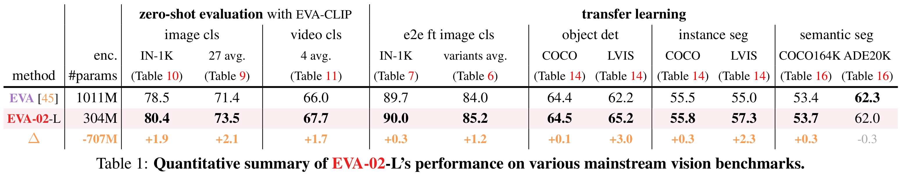

<div align="center">

<h2><a href="https://arxiv.org/abs/2303.11331">EVA-02: A Visual Representation for Neon Genesis</a></h2>

[Yuxin Fang](https://github.com/Yuxin-CV)<sup>2,1</sup>, [Quan Sun](https://github.com/Quan-Sun)<sup>1</sup>, [Xinggang Wang](https://xinggangw.info/)<sup>2</sup>, [Tiejun Huang](https://scholar.google.com/citations?user=knvEK4AAAAAJ&hl=en)<sup>1</sup>, [Xinlong Wang](https://www.xloong.wang/)<sup>1</sup>, [Yue Cao](http://yue-cao.me/)<sup>1</sup>
 
<sup>1</sup>[BAAI](https://www.baai.ac.cn/english.html), <sup>2</sup>[HUST](http://english.hust.edu.cn/)

</div>


We launch EVA-02, a next-generation Transformer-based visual representation pre-trained to reconstruct strong and robust **language-aligned vision features** via masked image modeling. 

With an updated plain Transformer architecture as well as extensive pre-training from an open & accessible giant CLIP vision encoder, EVA-02 demonstrates superior performance compared to prior state-of-the-art approaches across various representative vision tasks, while utilizing significantly fewer parameters and compute budgets. 

Notably, using exclusively publicly accessible training data, EVA-02 with only **304M** parameters achieves a phenomenal **90.0** fine-tuning top-1 accuracy on ImageNet-1K val set. 
Additionally, EVA-02-CLIP can reach up to **80.4** zero-shot top-1 on ImageNet-1K, outperforming the previous largest & best open-sourced CLIP with only ~1/6 parameters and ~1/6 image-text training data. 

We offer four EVA-02 variants in various model sizes, ranging **from 6M to 304M** parameters, all with impressive performance.

We hope our efforts enable a broader range of the research community to advance the field in a more **efficient, affordable and equitable** manner.


## Summary of EVA-02 performance




## Get Started
- [Pre-training](asuka)
- [Image Classification](asuka)
- [Object Detection & Instance Segmentation](det)
- [Semantic Segmentation](seg)
- [CLIP](../EVA-CLIP)


## Best Practice
- If you would like to use / fine-tune EVA-02 in your project, please start with **a shorter schedule & smaller learning rate** (compared with the baseline setting) first.
- Using EVA-02 as a feature extractor: https://github.com/baaivision/EVA/issues/56.

## BibTeX & Citation

```
@article{EVA02,
  title={EVA-02: A Visual Representation for Neon Genesis},
  author={Fang, Yuxin and Sun, Quan and Wang, Xinggang and Huang, Tiejun and Wang, Xinlong and Cao, Yue},
  journal={arXiv preprint arXiv:2303.11331},
  year={2023}
}
```

## Acknowledgement
[EVA-01](https://github.com/baaivision/EVA/tree/master/EVA-01), [BEiT](https://github.com/microsoft/unilm/tree/master/beit), [BEiTv2](https://github.com/microsoft/unilm/tree/master/beit2), [CLIP](https://github.com/openai/CLIP), [MAE](https://github.com/facebookresearch/mae/), [timm](https://github.com/rwightman/pytorch-image-models), [DeepSpeed](https://github.com/microsoft/DeepSpeed), [Apex](https://github.com/NVIDIA/apex), [xFormer](https://github.com/facebookresearch/xformers), [detectron2](https://github.com/facebookresearch/detectron2), [mmcv](https://github.com/open-mmlab/mmcv), [mmdet](https://github.com/open-mmlab/mmdetection), [mmseg](https://github.com/open-mmlab/mmsegmentation), [ViT-Adapter](https://github.com/czczup/ViT-Adapter), [detrex](https://github.com/IDEA-Research/detrex), and [rotary-embedding-torch](https://github.com/lucidrains/rotary-embedding-torch).


## Contact

- For help and issues associated with EVA-02, or reporting a bug, please open a [GitHub Issue with label EVA-02](https://github.com/baaivision/EVA/labels/EVA-02). 
Let's build a better & stronger EVA-02 together :)

- **We are hiring** at all levels at BAAI Vision Team, including full-time researchers, engineers and interns. 
If you are interested in working with us on **foundation model, self-supervised learning and multimodal learning**, please contact [Yue Cao](http://yue-cao.me/) (`caoyue@baai.ac.cn`) and [Xinlong Wang](https://www.xloong.wang/) (`wangxinlong@baai.ac.cn`).