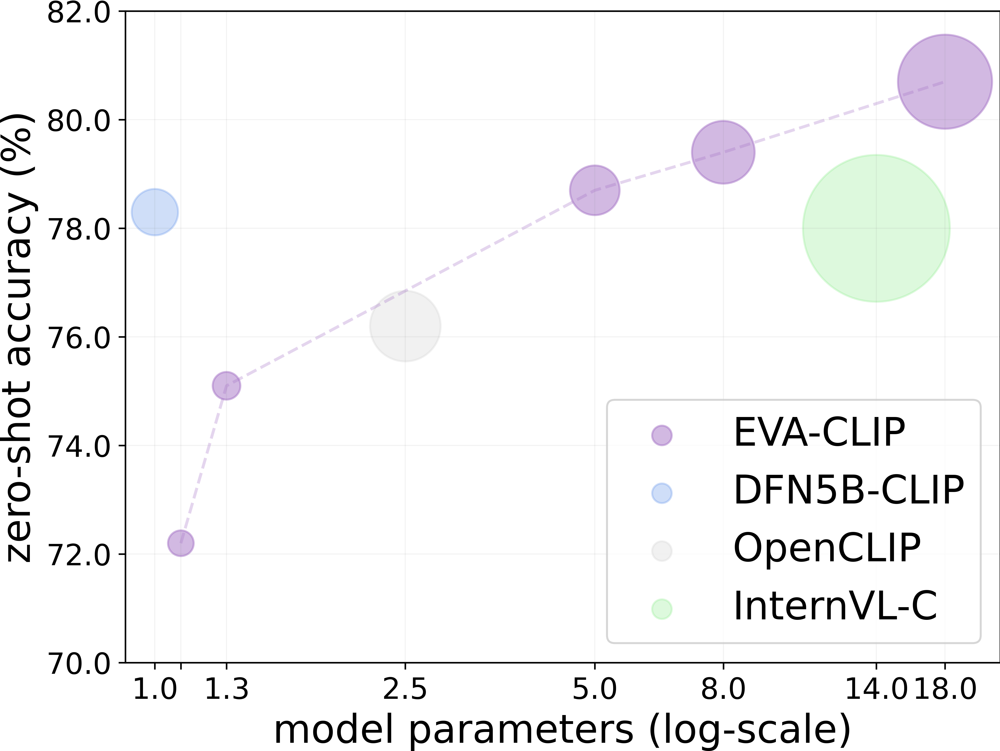

<div align="center">

<h2><a href="https://arxiv.org/abs/2402.04252">EVA-CLIP-18B: Scaling CLIP to 18 Billion Parameters</a></h2>

[Quan Sun](https://github.com/Quan-Sun)<sup>1*</sup>, [Jinsheng Wang](https://github.com/Wolfwjs/)<sup>1*</sup>, [Qiying Yu](https://yqy2001.github.io)<sup>1,2*</sup>, [Yufeng Cui](https://scholar.google.com/citations?hl=en&user=5Ydha2EAAAAJ)<sup>1</sup>, [Fan Zhang](https://scholar.google.com/citations?user=VsJ39HMAAAAJ)<sup>1</sup>, [Xiaosong Zhang](https://zhangxiaosong18.github.io)<sup>1</sup>, [Xinlong Wang](https://www.xloong.wang/)<sup>1</sup>
 
<sup>1</sup> [BAAI](https://www.baai.ac.cn/english.html), <sup>2</sup> [THU](https://air.tsinghua.edu.cn) <br><sup>*</sup> equal contribution

</div>


Scaling up contrastive language-image pretraining (CLIP) is critical for empowering both vision and multimodal models. We present EVA-CLIP-18B, the largest and most powerful open-source CLIP model to date, with 18-billion parameters. With only 6-billion training samples seen, EVA-CLIP-18B achieves an exceptional **80.7%** zero-shot top-1 accuracy averaged across 27 widely recognized image classification benchmarks, outperforming its forerunner EVA-CLIP (5-billion parameters) and other open-source CLIP models by a large margin. Remarkably, we observe a consistent performance improvement with the model size scaling of EVA-CLIP, despite maintaining a constant training dataset of 2-billion image-text pairs from LAION-2B and COYO-700M. This dataset is openly available and much smaller than the in-house datasets (e.g., DFN-5B, WebLI-10B) employed in other state-of-the-art CLIP models. EVA-CLIP-18B demonstrates the potential of EVA-style weak-to-strong visual model scaling. With our model weights made publicly available, we hope to facilitate future research in vision and multimodal foundation models.


**Table of Contents**

- [Summary of EVA-CLIP performance](#summary-of-eva-clip-performance)
- [Model Card](#model-card)
  - [EVA-CLIP-8B](#eva-clip-8b)
  - [EVA-CLIP-18B](#eva-clip-18b)
- [Setup](#setup)
- [Usage](#usage)
- [BibTeX \& Citation](#bibtex--citation)
- [Acknowledgement](#acknowledgement)


## Summary of EVA-CLIP performance



Scaling behavior of EVA-CLIP with zero-shot classification performance averaged across 27 image classification benchmarks, compared with the current state-of-the-art and largest CLIP models (224px). The diameter of each circle demonstrates the forward GFLOPs × the number of training samples seen. The performance of EVA-CLIP consistently improves as scaling up.

## Model Card

### EVA-8B and EVA-18B
<div align="center">

| model name | total #params | seen samples | pytorch weight |
|:-----------|:------:|:------:|:------:|
| `EVA_8B_psz14` | 7.5B | 6B | [PT](https://huggingface.co/BAAI/EVA-CLIP-8B/resolve/main/EVA_8B_psz14.bin) (`30.1GB`) |
| `EVA_18B_psz14.fp16` | 17.5B | 6B | [PT](https://huggingface.co/BAAI/EVA-CLIP-18B/resolve/main/EVA_18B_psz14.fp16.bin) (`35.3GB`) |

</div>

### EVA-CLIP-8B

> Image encoder MIM teacher: [EVA02_CLIP_E_psz14_plus_s9B](https://huggingface.co/QuanSun/EVA-CLIP/blob/main/EVA02_CLIP_E_psz14_s4B.pt).

<div align="center">

| model name | image enc. init. ckpt | text enc. init. ckpt | total #params | training data  |  training batch size |  gpus for training | img. cls. avg. acc. | video cls. avg. acc. | retrieval MR | hf weight | pytorch weight |
|:-----|:-----|:-----------|:------:|:------:|:------:|:------:|:------:|:------:|:------:|:------:|:------:|
| `EVA-CLIP-8B` | `EVA_8B_psz14` | `EVA02_CLIP_E_psz14_plus_s9B` | 8.1B | Merged-2B | 178K | 384 A100(40GB) | **79.4** | **73.6** | **86.2**| [🤗 HF](https://huggingface.co/BAAI/EVA-CLIP-8B) | [PT](https://huggingface.co/BAAI/EVA-CLIP-8B/resolve/main/EVA_CLIP_8B_psz14_s9B.pt) (`32.9GB`)|
| `EVA-CLIP-8B-448` | `EVA-CLIP-8B` | `EVA-CLIP-8B` | 8.1B | Merged-2B | 24K | 384 A100(40GB) | **80.0** | **73.7** | **86.4** | [🤗 HF](https://huggingface.co/BAAI/EVA-CLIP-8B-448) | [PT](https://huggingface.co/BAAI/EVA-CLIP-8B-448/resolve/main/EVA_CLIP_8B_psz14_plus_s0.6B.pt) (`32.9GB`)|

</div>

### EVA-CLIP-18B

> Image encoder MIM teacher: [EVA02_CLIP_E_psz14_plus_s9B](https://huggingface.co/QuanSun/EVA-CLIP/blob/main/EVA02_CLIP_E_psz14_s4B.pt).

<div align="center">

| model name | image enc. init. ckpt | text enc. init. ckpt | total #params | training data  |  training batch size |  gpus for training | img. cls. avg. acc. | video cls. avg. acc. | retrieval MR | hf weight | pytorch weight |
|:-----|:-----|:-----------|:------:|:------:|:------:|:------:|:------:|:------:|:------:|:------:|:------:|
| `EVA-CLIP-18B` | `EVA_18B_psz14` | `EVA02_CLIP_E_psz14_plus_s9B` | 18.1B | Merged-2B+ | 108K | 360 A100(40GB) | **80.7** | **75.0** | **87.8**| [🤗 HF](https://huggingface.co/BAAI/EVA-CLIP-18B) | [PT](https://huggingface.co/BAAI/EVA-CLIP-18B/resolve/main/EVA_CLIP_18B_psz14_s6B.fp16.pt) (`36.7GB`) |


</div>


- To construct Merged-2B, we merged 1.6 billion samples from [LAION-2B](https://laion.ai/blog/laion-5b/) dataset with 0.4 billion samples from [COYO-700M](https://github.com/kakaobrain/coyo-dataset).
- The Merged-2B+ consists of all samples from Merged-2B, along with 20 millions samples from [LAION-COCO](https://laion.ai/blog/laion-coco/) and 23 millions samples from Merged-video including [VideoCC](https://github.com/google-research-datasets/videoCC-data), [InternVid](https://huggingface.co/datasets/OpenGVLab/InternVid) and [WebVid-10M](https://maxbain.com/webvid-dataset/). Merged-video was added at the end of the training process.

**It's important to note that all results presented in the paper are evaluated using PyTorch weights. There may be differences in performance when using Hugging Face (hf) models.**

## Setup


First, clone the repo and install required packages:
```bash
conda create --name shinji python=3.8 -y
conda activate shinji

git clone git@github.com:baaivision/EVA.git
cd EVA/EVA-CLIP-18B
pip install torch==1.12.1+cu116 torchvision==0.13.1+cu116 --extra-index-url https://download.pytorch.org/whl/cu116
pip install -r requirements.txt
```

Then, install [Apex](https://github.com/NVIDIA/apex#linux) and [xFormer](https://github.com/facebookresearch/xformers#installing-xformers) following the official instruction. 


Core packages: 
- [Pytorch](https://pytorch.org/) version 1.12.1 
- [torchvision](https://pytorch.org/vision/stable/index.html) version 0.13.0
- [timm](https://github.com/rwightman/pytorch-image-models) version 0.5.4 
- [DeepSpeed](https://github.com/microsoft/DeepSpeed) version 0.8.3
- [Apex](https://github.com/NVIDIA/apex) (fused layer norm)
- [xFormer](https://github.com/facebookresearch/xformers) (fast and memory efficient MHSA)

## Zero-Shot Evaluation

We use [CLIP-Benchmark](https://github.com/LAION-AI/CLIP_benchmark) to evaluate the zero-shot performance of EVA-CLIP models. Following [vissl](https://github.com/facebookresearch/vissl/blob/main/extra_scripts/datasets/create_k700_data_files.py), we evauate the zero-shot video classification using 1 middle frame. Further details regarding the evaluation datasets can be found in our paper, particularly in Table 11.

## Usage

### Huggingface Version
```python

from PIL import Image
from transformers import AutoModel, AutoConfig
from transformers import CLIPImageProcessor, pipeline, CLIPTokenizer
import torch
import torchvision.transforms as T
from torchvision.transforms import InterpolationMode

image_path = "CLIP.png"
model_name_or_path = "BAAI/EVA-CLIP-8B" # or /path/to/local/EVA-CLIP-8B
image_size = 224

processor = CLIPImageProcessor.from_pretrained("openai/clip-vit-large-patch14")

# use image processor with conig
# processor = CLIPImageProcessor(size={"shortest_edge":image_size}, do_center_crop=True, crop_size=image_size)

## you can also directly use the image processor by torchvision
## squash
# processor = T.Compose(
#     [
#         T.Lambda(lambda img: img.convert('RGB') if img.mode != 'RGB' else img),
#         T.Resize((image_size, image_size), interpolation=InterpolationMode.BICUBIC),
#         T.ToTensor(),
#         T.Normalize(mean=(0.48145466, 0.4578275, 0.40821073), std=(0.26862954, 0.26130258, 0.27577711))
#     ]
# )
## shortest
## processor = T.Compose(
#     [
#         T.Lambda(lambda img: img.convert('RGB') if img.mode != 'RGB' else img),
#         T.Resize(image_size, interpolation=InterpolationMode.BICUBIC),
#         T.CenterCrop(image_size),
#         T.ToTensor(),
#         T.Normalize(mean=(0.48145466, 0.4578275, 0.40821073), std=(0.26862954, 0.26130258, 0.27577711))
#     ]
# )

model = AutoModel.from_pretrained(
    model_name_or_path, 
    torch_dtype=torch.float16,
    trust_remote_code=True).to('cuda').eval()

image = Image.open(image_path)
captions = ["a diagram", "a dog", "a cat"]
tokenizer = CLIPTokenizer.from_pretrained(model_name_or_path)
input_ids = tokenizer(captions,  return_tensors="pt", padding=True).input_ids.to('cuda')
input_pixels = processor(images=image, return_tensors="pt", padding=True).pixel_values.to('cuda')

with torch.no_grad(), torch.cuda.amp.autocast():
    image_features = model.encode_image(input_pixels)
    text_features = model.encode_text(input_ids)
    image_features /= image_features.norm(dim=-1, keepdim=True)
    text_features /= text_features.norm(dim=-1, keepdim=True)

label_probs = (100.0 * image_features @ text_features.T).softmax(dim=-1)
print(f"Label probs: {label_probs}")
```

### Pytorch version

```python
import torch
from eva_clip import create_model_and_transforms, get_tokenizer
from PIL import Image

model_name = "EVA-CLIP-8B" 
pretrained = "eva_clip" # or "/path/to/EVA_CLIP_8B_psz14_s9B.pt"

image_path = "CLIP.png"
caption = ["a diagram", "a dog", "a cat"]

device = "cuda" if torch.cuda.is_available() else "cpu"
model, _, processor = create_model_and_transforms(model_name, pretrained, force_custom_clip=True)
tokenizer = get_tokenizer(model_name)
model = model.to(device)

image = processor(Image.open(image_path)).unsqueeze(0).to(device)
text = tokenizer(["a diagram", "a dog", "a cat"]).to(device)

with torch.no_grad(), torch.cuda.amp.autocast():
    image_features = model.encode_image(image)
    text_features = model.encode_text(text)
    image_features /= image_features.norm(dim=-1, keepdim=True)
    text_features /= text_features.norm(dim=-1, keepdim=True)

    text_probs = (100.0 * image_features @ text_features.T).softmax(dim=-1)

print("Label probs:", text_probs)
```

You can leverage [deepspeed.zero.Init()](https://deepspeed.readthedocs.io/en/stable/zero3.html#constructing-massive-models) with deepspeed zero stage 3 if you have limited CPU memory. For loading a pretrained checkpoint in the context of using deepspeed.zero.Init(), it's advised to use the `load_zero_partitions()` function in `eva_clip/factory.py`. 

## BibTeX & Citation

```
@article{EVA-CLIP-18B,
  title={EVA-CLIP-18B: Scaling CLIP to 18 Billion Parameters}, 
  author={Quan Sun and Jinsheng Wang and Qiying Yu and Yufeng Cui and Fan Zhang and Xiaosong Zhang and Xinlong Wang},
  journal={arXiv preprint arXiv:2402.04252},
  year={2023}
}
```


## Acknowledgement
EVA-CLIP is built using the awesome [OpenCLIP](https://github.com/mlfoundations/open_clip), [EVA-01](https://github.com/baaivision/EVA/tree/master/EVA-01), [CLIP](https://github.com/openai/CLIP), [timm](https://github.com/rwightman/pytorch-image-models), [transformers](https://github.com/huggingface/transformers), [DeepSpeed](https://github.com/microsoft/DeepSpeed), [CLIP-Benchmark](https://github.com/LAION-AI/CLIP_benchmark), [Apex](https://github.com/NVIDIA/apex) and [xFormer](https://github.com/facebookresearch/xformers).

