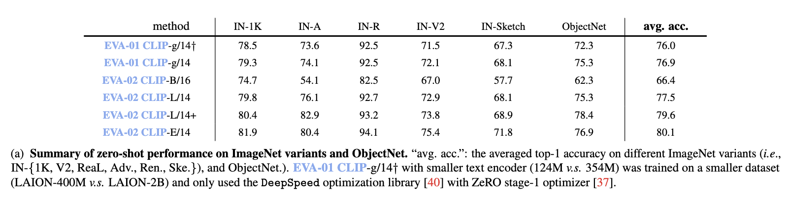

<div align="center">

<h2>EVA-CLIP: Improved Training Techniques for CLIP at Scale</h2>

</div>


> Mar, 21, 2023: The complete suit of EVA-CLIP (technical report, model weights, evaluation & training code) will be available in one week.

We launch EVA-CLIP, a series of models that significantly improve the efficiency and effectiveness of CLIP training. 
Our approach incorporates new techniques for representation learning, optimization, and augmentation, enabling EVA-CLIP to achieve superior performance compared to previous CLIP models with the same number of parameters but significantly smaller training costs.

Notably, using exclusively publicly accessible training data, our large-sized EVA-02 CLIP-L/14 can reach up to **80.4** zero-shot top-1 on ImageNet-1K, outperforming the previous largest & best open-sourced CLIP with only ~1/6 parameters and ~1/6 image-text training data. 
Our largest 4.7B-parameter EVA-02 CLIP-E/14 with only 4 billion seen samples achieves **81.9** zero-shot top-1 accuracy on ImageNet-1K.


**Table of Contents**

- [Summary of EVA-CLIP performance](#summary-of-eva-clip-performance)
- [Model Card](#model-card)
  - [EVA-01-CLIP Series (MIM teacher: OpenAI CLIP-Large)](#eva-01-clip-series-mim-teacher-openai-clip-large)
  - [EVA-02-CLIP Series (MIM teacher: ``EVA01_CLIP_g_14_psz14_s11B``)](#eva-02-clip-series-mim-teacher-eva01_clip_g_14_psz14_s11b)
- [Setup](#setup)
- [Evaluation of Zero-shot Image Classification Performance](#evaluation-of-zero-shot-image-classification-performance)
  - [Evaluate EVA-CLIP on IN-1K](#evaluate-eva-clip-on-in-1k)
- [Pre-training](#pre-training)
  - [Pre-train EVA-CLIP on LAION-2B dataset](#pre-train-eva-clip-on-laion-2b-dataset)
- [Acknowledgement](#acknowledgement)


## Summary of EVA-CLIP performance



## Model Card

### EVA-01-CLIP Series (MIM teacher: [OpenAI CLIP-Large](https://github.com/openai/CLIP))
<div align="center">

| model name | total #params | training precision | training data  |  training batch size |  gpus for training | IN-1K zero-shot top-1 | MSCOCO T2I R@5 | weight |
|:-----------|:------:|:------:|:------:|:------:|:------:|:------:|:------:|:------:|
| `EVA01_CLIP_g_14_psz14_s11B` | 1.1B | `fp16` | [LAION-400M](https://laion.ai/blog/laion-400-open-dataset/) | 41K | 256 A100(40GB) | 78.5 | 68.5 | [🤗 HF link](https://huggingface.co/QuanSun/EVA-CLIP/blob/main/EVA01_CLIP_g_14_psz14_s11B.pt) (`2.2GB`) |
| `EVA01_CLIP_g_14_plus_psz14_s11B` | 1.3B | `fp16` | Merged-2B | 114K | 112 A100(40GB) | 79.3 | 74.0 | [🤗 HF link](https://huggingface.co/QuanSun/EVA-CLIP/blob/main/EVA01_CLIP_g_14_plus_psz14_s11B.pt) (`2.7GB`) |
</div>

### EVA-02-CLIP Series (MIM teacher: ``EVA01_CLIP_g_14_psz14_s11B``)
<div align="center">

| model name | total #params | training precision | training data  |  training batch size |  gpus for training | IN-1K zero-shot top-1 | MSCOCO T2I R@5 | weight |
|:-----------|:------:|:------:|:------:|:------:|:------:|:------:|:------:|:------:|
| `EVA02_CLIP_B_psz16_s8B` | 149M | `fp16` | Merged-2B | 131K | 64 A100(40GB) | 74.7 | 66.9 | [🤗 HF link](https://huggingface.co/QuanSun/EVA-CLIP/blob/main/EVA02_CLIP_B_psz16_s8B.pt) (`300MB`) |
| `EVA02_CLIP_L_psz14_s4B` | 428M | `fp16` | Merged-2B | 131K | 128 A100(40GB) | 79.8 | 71.2 | [🤗 HF link](https://huggingface.co/QuanSun/EVA-CLIP/blob/main/EVA02_CLIP_L_psz14_s4B.pt) (`856MB`) |
| `EVA02_CLIP_L_336_psz14_s6B` | 428M | `fp16` | Merged-2B | 61K | 128 A100(40GB) | 80.4 | 71.7 | [🤗 HF link](https://huggingface.co/QuanSun/EVA-CLIP/blob/main/EVA02_CLIP_L_336_psz14_s6B.pt) (`856MB`) |
| `EVA02_CLIP_E_psz14_s4B.pt` | 4.7B | `fp16` | [LAION-2B](https://laion.ai/blog/laion-5b/) | 144K | 144 A100(80GB) | 81.9 | 74.7 | [🤗 HF link](https://huggingface.co/QuanSun/EVA-CLIP/blob/main/EVA02_CLIP_E_psz14_s4B.pt) (`9.4GB`) |

</div>

- To construct Merged-2B, we merged 1.6 billion samples from [LAION-2B](https://laion.ai/blog/laion-5b/) dataset with 0.4 billion samples from [COYO-700M](https://github.com/kakaobrain/coyo-dataset).

- To our knowledge, EVA-CLIP series are the most performant open-sourced CLIP models at all scales, evaluated via zero-shot classification performance, especially on mainstream classification benchmarks such as ImageNet along with its variants.
For more details about EVA-CLIP, please refer to our [paper (coming very soon)]().

## Setup


First, clone the repo and install required packages:
```bash
conda create --name rei python=3.8 -y
conda activate rei

git clone git@github.com:baaivision/EVA.git
cd EVA-CLIP
pip install torch==1.12.1+cu116 torchvision==0.13.1+cu116 --extra-index-url https://download.pytorch.org/whl/cu116
pip install -r requirements.txt
```

Then, install [Apex](https://github.com/NVIDIA/apex#linux) and [xFormer](https://github.com/facebookresearch/xformers#installing-xformers) following the official instruction. 


Core packages: 
- [Pytorch](https://pytorch.org/) version 1.12.1 
- [torchvision](https://pytorch.org/vision/stable/index.html) version 0.13.0
- [timm](https://github.com/rwightman/pytorch-image-models) version 0.5.4 
- [DeepSpeed](https://github.com/microsoft/DeepSpeed) version 0.6.5 (`fp16` training and ZeRO optimizer)
- [Apex](https://github.com/NVIDIA/apex) (fused layer norm)
- [xFormer](https://github.com/facebookresearch/xformers) (fast and memory efficient MHSA)

## Evaluation of Zero-shot Image Classification Performance
### Evaluate EVA-CLIP on IN-1K
We use the standard IN-1K dataset (1.2M images). 
Download it from http://image-net.org.
Then, move and extract the training and validation images to labeled subfolders, using the [shell script](https://github.com/pytorch/examples/blob/main/imagenet/extract_ILSVRC.sh).

<details>
  <summary>Evaluate the <code>EVA01_CLIP_g_14_psz14_s11B</code> on <b>IN-1K val</b> using a single node with 1 gpu (click to expand).</summary>

```bash    
MODEL_NAME=EVA-ViT-g-14-X

EVAL_CKPT=/path/to/EVA01_CLIP_g_14_psz14_s11B.pt

DATA_PATH=/path/to/IN-1K/val

cd rei

python -m torch.distributed.launch --nproc_per_node=1 --nnodes=$WORLD_SIZE --node_rank=$RANK \
	--master_addr=$MASTER_ADDR --master_port=12355 --use_env training/main.py \
        --imagenet-val ${DATA_PATH} \
        --model ${MODEL_NAME} \
        --pretrained ${EVAL_CKPT} \
        --enable_deepspeed
```

</details>

<details>
  <summary>Evaluate the <code>EVA01_CLIP_g_14_plus_psz14_s11B</code> on <b>IN-1K val</b> using a single node with 1 gpu (click to expand).</summary>

```bash    
MODEL_NAME=EVA-ViT-g-14-text-H-X

EVAL_CKPT=/path/to/EVA01_CLIP_g_14_plus_psz14_s11B.pt

DATA_PATH=/path/to/IN-1K/val

cd rei

python -m torch.distributed.launch --nproc_per_node=1 --nnodes=$WORLD_SIZE --node_rank=$RANK \
	--master_addr=$MASTER_ADDR --master_port=12355 --use_env training/main.py \
        --imagenet-val ${DATA_PATH} \
        --model ${MODEL_NAME} \
        --pretrained ${EVAL_CKPT} \
        --enable_deepspeed
```

</details>

<details>
  <summary>Evaluate the <code>EVA02_CLIP_B_psz16_s8B</code> on <b>IN-1K val</b> using a single node with 1 gpu (click to expand).</summary>

```bash    
MODEL_NAME=EVA-ViT-B-16-X

EVAL_CKPT=/path/to/EVA02_CLIP_B_psz16_s8B.pt

DATA_PATH=/path/to/IN-1K/val

cd rei

python -m torch.distributed.launch --nproc_per_node=1 --nnodes=$WORLD_SIZE --node_rank=$RANK \
	--master_addr=$MASTER_ADDR --master_port=12355 --use_env training/main.py \
        --imagenet-val ${DATA_PATH} \
        --model ${MODEL_NAME} \
        --pretrained ${EVAL_CKPT} \
        --enable_deepspeed
```

</details>

<details>
  <summary>Evaluate the <code>EVA02_CLIP_L_psz14_s4B</code> on <b>IN-1K val</b> using a single node with 1 gpu (click to expand).</summary>

```bash    
MODEL_NAME=EVA-ViT-L-14-X

EVAL_CKPT=/path/to/EVA02_CLIP_L_psz14_s4B.pt

DATA_PATH=/path/to/IN-1K/val

cd rei

python -m torch.distributed.launch --nproc_per_node=1 --nnodes=$WORLD_SIZE --node_rank=$RANK \
	--master_addr=$MASTER_ADDR --master_port=12355 --use_env training/main.py \
        --imagenet-val ${DATA_PATH} \
        --model ${MODEL_NAME} \
        --pretrained ${EVAL_CKPT} \
        --enable_deepspeed
```

</details>


<details>
  <summary>Evaluate the <code>EVA02_CLIP_L_336_psz14_s6B</code> on <b>IN-1K val</b> using a single node with 1 gpu (click to expand).</summary>

```bash    
MODEL_NAME=EVA-ViT-4b-14-text-H-X

EVAL_CKPT=/path/to/EVA02_CLIP_L_336_psz14_s6B.pt

DATA_PATH=/path/to/IN-1K/val

cd rei

python -m torch.distributed.launch --nproc_per_node=1 --nnodes=$WORLD_SIZE --node_rank=$RANK \
	--master_addr=$MASTER_ADDR --master_port=12355 --use_env training/main.py \
        --imagenet-val ${DATA_PATH} \
        --model ${MODEL_NAME} \
        --pretrained ${EVAL_CKPT} \
        --enable_deepspeed
```

</details>


<details>
  <summary>Evaluate the <code>EVA02_CLIP_E_psz14_s4B</code> on <b>IN-1K val</b> using a single node with 1 gpu (click to expand).</summary>

```bash    
MODEL_NAME=EVA-ViT-L-14-X-336

EVAL_CKPT=/path/to/EVA02_CLIP_E_psz14_s4B.pt

DATA_PATH=/path/to/IN-1K/val

cd rei

python -m torch.distributed.launch --nproc_per_node=1 --nnodes=$WORLD_SIZE --node_rank=$RANK \
	--master_addr=$MASTER_ADDR --master_port=12355 --use_env training/main.py \
        --imagenet-val ${DATA_PATH} \
        --model ${MODEL_NAME} \
        --pretrained ${EVAL_CKPT} \
        --enable_deepspeed
```

</details>

## Pre-training

### Pre-train EVA-CLIP on LAION-2B dataset

We provide instruction of pre-training EVA-CLIP on LAION-2B dataset and Merged-2B dataset (coming very soon). 

Please prepare [LAION-2B](https://laion.ai/blog/laion-5b/) dataset and [COYO-700M](https://github.com/kakaobrain/coyo-dataset) dataset.
- To construct Merged-2B, merging 1.6 billion random samples from [LAION-2B](https://laion.ai/blog/laion-5b/) dataset with 0.4 billion random samples from [COYO-700M](https://github.com/kakaobrain/coyo-dataset).

Please prepare EVA-01, EVA-02, Openai CLIP and Open CLIP models.


| model name | total #params | training precision | download link |
|:-----------|:------:|:------:|:------:|
| `EVA01_g_psz14` | 1.0B | `fp16` | [🤗 HF link](https://huggingface.co/QuanSun/EVA-CLIP/blob/main/EVA01_g_psz14.pt) (`2.0GB`) |
| `EVA02_B_psz14to16` | 86M | `fp16` | [🤗 HF link](https://huggingface.co/QuanSun/EVA-CLIP/blob/main/EVA02_B_psz14to16.pt) (`176MB`) |
| `EVA02_L_psz14` | 304M | `fp16` | [🤗 HF link](https://huggingface.co/QuanSun/EVA-CLIP/blob/main/EVA02_L_psz14.pt) (`609MB`) |
| `EVA02_CLIP_L_psz14_224to336` | 304M | `fp16` | [🤗 HF link](https://huggingface.co/QuanSun/EVA-CLIP/blob/main/EVA02_CLIP_L_psz14_224to336.pt) (`857MB`) |
| `EVA02_E_psz14` | 4.4B | `fp16` | [🤗 HF link](https://huggingface.co/QuanSun/EVA-CLIP/blob/main/EVA02_E_psz14.pt) (`8.7GB`) |
| `openai/clip-vit-base-patch16`| 149M | `fp16` | [🤗 HF link](https://huggingface.co/openai/clip-vit-base-patch16/blob/main/pytorch_model.bin) (`599MB`) |
| `openai/clip-vit-large-patch14`| 428M | `fp16` | [🤗 HF link](https://huggingface.co/openai/clip-vit-large-patch14/blob/main/pytorch_model.bin) (`1.7GB`) |
| `laion/CLIP-ViT-H-14-laion2B-s32B-b79K`| 1.0B | `bf16` | [🤗 HF link](https://huggingface.co/laion/CLIP-ViT-H-14-laion2B-s32B-b79K/blob/main/pytorch_model.bin) (`3.9GB`) |

EVA02_B_psz14to16 interpolates the kernel size of patch_embed from 14x14 to 16x16, and interpolate the pos_embed from 16x16 to 14x14.

EVA02_CLIP_L_psz14_224to336 interpolates the pos_embed from 16x16 to 24x24 for training EVA02_CLIP_L_336_psz14_s6B.

<details>
<summary>Pre-train <code>EVA01_CLIP_g_14_plus_psz14_s11B</code> on <b>Merged-2B</b> with 14 nodes (click to expand).</summary>

```bash
MODEL=EVA-ViT-g-14-text-H-X
PRETRAINED_IMAGE=/path/to/EVA01_g_psz14.pt
PRETRAINED_TEXT=/path/to/openai/clip-vit-large-patch14/pytorch_model.bin

# Following OpenCLIP, we preprocess data by webdataset. We concat paths of LAION-2B and COYO-700M with `;`.
MERGE_2B_DATA_PATH="/path/to/laion2b_en_data/img_data/{000000..164090}.tar;/path/to/coyo700m_en_data/img_data/{000000..047435}.tar"
# LAION_2B_DATA_PATH="/path/to/laion2b_en_data/img_data/{000000..164090}.tar"
VAL_DATA_PATH=/path/to/IN-1K/val

cd rei

python -m torch.distributed.launch --nproc_per_node=8 \
       	--nnodes=$WORLD_SIZE --node_rank=$RANK \
	--master_addr=$MASTER_ADDR --master_port=12355 --use_env \
    training/main.py \
        --save-frequency 1 \
        --zeroshot-frequency 1 \
        --report-to="wandb, tensorboard" \
        --wandb-project-name="eva-clip" \
        --wandb-notes="eva01_clip_g_plus_14" \
        --train-num-samples 40000000 \
        --dataset-resampled \
        --train-data-list=${MERGE_2B_DATA_PATH} \
        --dataset-type-list="webdataset;webdataset" \
        --imagenet-val=${VAL_DATA_PATH} \
        --warmup 2000 \
        --batch-size=1024 \
        --epochs=100 \
        --lr=5e-4 \
        --visual-lr=4e-4 \
        --text-lr=4e-5 \
        --wd=0.05 \
        --visual-wd=0.05 \
        --text-wd=0.05 \
        --ld=1.0 \
        --visual-ld=0.85 \
        --text-ld=0.75 \
        --grad-clip-norm=5.0 \
        --smoothing=0. \
        --workers=8 \
        --model EVA-ViT-L-14-X \
        --name='eva-vit-g-14-text-H-x-lamb-patch_drop-14nodes-b114k-stage1-laion2b-coyo-round-robin' \
        --pretrained-image=${PRETRAINED_IMAGE} \
        --pretrained-text=${PRETRAINED_TEXT} \
        --pretrained-visual-source="other" \
        --pretrained-text-source="clip" \
        --skip-list head.weight head.bias lm_head.weight lm_head.bias mask_token text_projection logit_scale \
        --seed 4096 \
        --gather-with-grad \
        --grad-checkpointing \
        --local-loss \
        --force-custom-clip \
        --force-patch-dropout=0.5 \
        --optimizer="lamb" \
        --zero-stage=1 \
        --enable-deepspeed
```

</details>

<details>
<summary>Pre-train <code>EVA02_CLIP_B_psz16_s8B</code> on <b>Merged-2B</b> with 8 nodes (click to expand).</summary>

```bash
MODEL=EVA-ViT-B-16-X
PRETRAINED_IMAGE=/path/to/EVA02_B_psz14to16.pt
PRETRAINED_TEXT=/path/to/openai/clip-vit-base-patch16/pytorch_model.bin

# Following OpenCLIP, we preprocess data by webdataset. We concat paths of LAION-2B and COYO-700M with `;`.

MERGE_2B_DATA_PATH="/path/to/laion2b_en_data/img_data/{000000..164090}.tar;/path/to/coyo700m_en_data/img_data/{000000..047435}.tar"
# LAION_2B_DATA_PATH="/path/to/laion2b_en_data/img_data/{000000..164090}.tar"
VAL_DATA_PATH=/path/to/IN-1K/val

cd rei

python -m torch.distributed.launch --nproc_per_node=8 \
       	--nnodes=$WORLD_SIZE --node_rank=$RANK \
	--master_addr=$MASTER_ADDR --master_port=12355 --use_env \
    training/main.py \
        --save-frequency 1 \
        --zeroshot-frequency 1 \
        --report-to="wandb, tensorboard" \
        --wandb-project-name="eva-clip" \
        --wandb-notes="eva02_clip_B_16" \
        --train-num-samples 40000000 \
        --dataset-resampled \
        --train-data-list=${MERGE_2B_DATA_PATH} \
        --dataset-type-list="webdataset;webdataset" \
        --imagenet-val=${VAL_DATA_PATH} \
        --warmup 2000 \
        --batch-size=2048 \
        --epochs=200 \
        --lr=5e-4 \
        --visual-lr=2e-4 \
        --text-lr=2e-5 \
        --wd=0.05 \
        --visual-wd=0.05 \
        --text-wd=0.05 \
        --ld=1.0 \
        --visual-ld=0.75 \
        --text-ld=0.75 \
        --grad-clip-norm=5.0 \
        --smoothing=0. \
        --workers=8 \
        --model EVA-ViT-B-16-X-X \
        --name='eva-vit-b-16-x-lamb-8nodes-b131k-stage1-laion2b-coyo-round-robin' \
        --pretrained-image=${PRETRAINED_IMAGE} \
        --pretrained-text=${PRETRAINED_TEXT} \
        --pretrained-visual-source="other" \
        --pretrained-text-source="clip" \
        --skip-list head.weight head.bias lm_head.weight lm_head.bias mask_token text_projection logit_scale \
        --seed 4096 \
        --gather-with-grad \
        --grad-checkpointing \
        --local-loss \
        --force-custom-clip \
        --force-patch-dropout=0 \
        --optimizer="lamb" \
        --zero-stage=1 \
        --enable-deepspeed
```

</details>

<details>
<summary>Pre-train <code>EVA02_CLIP_L_psz14_s4B</code> on <b>Merged-2B</b> with 16 nodes (click to expand).</summary>

```bash
MODEL=EVA-ViT-L-14-X
PRETRAINED_IMAGE=/path/to/EVA02_L_psz14.pt
PRETRAINED_TEXT=/path/to/openai/clip-vit-large-patch14/pytorch_model.bin

# Following OpenCLIP, we preprocess data by webdataset. We concat paths of LAION-2B and COYO-700M with `;`.
MERGE_2B_DATA_PATH="/path/to/laion2b_en_data/img_data/{000000..164090}.tar;/path/to/coyo700m_en_data/img_data/{000000..047435}.tar"
# LAION_2B_DATA_PATH="/path/to/laion2b_en_data/img_data/{000000..164090}.tar"
VAL_DATA_PATH=/path/to/IN-1K/val

cd rei

python -m torch.distributed.launch --nproc_per_node=8 \
       	--nnodes=$WORLD_SIZE --node_rank=$RANK \
	--master_addr=$MASTER_ADDR --master_port=12355 --use_env \
    training/main.py \
        --save-frequency 1 \
        --zeroshot-frequency 1 \
        --report-to="wandb, tensorboard" \
        --wandb-project-name="eva-clip" \
        --wandb-notes="eva02_clip_L_14" \
        --train-num-samples 40000000 \
        --dataset-resampled \
        --train-data-list=${MERGE_2B_DATA_PATH} \
        --dataset-type-list="webdataset;webdataset" \
        --imagenet-val=${VAL_DATA_PATH} \
        --warmup 2000 \
        --batch-size=1024 \
        --epochs=100 \
        --lr=5e-4 \
        --visual-lr=4e-4 \
        --text-lr=4e-5 \
        --wd=0.05 \
        --visual-wd=0.05 \
        --text-wd=0.05 \
        --ld=1.0 \
        --visual-ld=0.85 \
        --text-ld=0.75 \
        --grad-clip-norm=5.0 \
        --smoothing=0. \
        --workers=8 \
        --model EVA-ViT-L-14-X \
        --name='eva-vit-l-14-x-lamb-16nodes-b131k-stage1-laion2b-coyo-round-robin' \
        --pretrained-image=${PRETRAINED_IMAGE} \
        --pretrained-text=${PRETRAINED_TEXT} \
        --pretrained-visual-source="other" \
        --pretrained-text-source="clip" \
        --skip-list head.weight head.bias lm_head.weight lm_head.bias mask_token text_projection logit_scale \
        --seed 4096 \
        --gather-with-grad \
        --grad-checkpointing \
        --local-loss \
        --force-custom-clip \
        --force-patch-dropout=0 \
        --optimizer="lamb" \
        --zero-stage=1 \
        --enable-deepspeed
```

</details>

<details>
<summary>Pre-train <code>EVA02_CLIP_L_psz14_224to336</code> on <b>Merged-2B</b> with 16 nodes (click to expand).</summary>

```bash
MODEL=EVA-ViT-L-14-X-336
PRETRAINED=/path/to/EVA02_CLIP_L_psz14_224to336.pt

# Following OpenCLIP, we preprocess data by webdataset. We concat paths of LAION-2B and COYO-700M with `;`.
MERGE_2B_DATA_PATH="/path/to/laion2b_en_data/img_data/{000000..164090}.tar;/path/to/coyo700m_en_data/img_data/{000000..047435}.tar"
# LAION_2B_DATA_PATH="/path/to/laion2b_en_data/img_data/{000000..164090}.tar"
VAL_DATA_PATH=/path/to/IN-1K/val

cd rei

python -m torch.distributed.launch --nproc_per_node=8 \
       	--nnodes=$WORLD_SIZE --node_rank=$RANK \
	--master_addr=$MASTER_ADDR --master_port=12355 --use_env \
    training/main.py \
        --save-frequency 1 \
        --zeroshot-frequency 1 \
        --report-to="wandb, tensorboard" \
        --wandb-project-name="eva-clip" \
        --wandb-notes="eva02_clip_L_14_336" \
        --train-num-samples 40000000 \
        --dataset-resampled \
        --train-data-list=${MERGE_2B_DATA_PATH} \
        --dataset-type-list="webdataset;webdataset" \
        --imagenet-val=${VAL_DATA_PATH} \
        --warmup 2000 \
        --batch-size=480 \
        --epochs=50 \
        --lr=5e-4 \
        --visual-lr=4e-4 \
        --text-lr=4e-5 \
        --wd=0.05 \
        --visual-wd=0.05 \
        --text-wd=0.05 \
        --ld=1.0 \
        --visual-ld=0.75 \
        --text-ld=0.65 \
        --grad-clip-norm=5.0 \
        --smoothing=0. \
        --workers=8 \
        --model EVA-ViT-L-14-X-336 \
        --name='eva-vit-l-14-x-336-lamb-16nodes-b61k-stage1-laion2b-coyo-round-robin' \
        --pretrained=${PRETRAINED} \
        --skip-list head.weight head.bias lm_head.weight lm_head.bias mask_token text_projection logit_scale \
        --seed 4096 \
        --gather-with-grad \
        --grad-checkpointing \
        --local-loss \
        --force-custom-clip \
        --force-patch-dropout=0 \
        --optimizer="lamb" \
        --zero-stage=1 \
        --enable-deepspeed
```

</details>

<details>
<summary>Pre-train <code>EVA02_CLIP_E_psz14_s4B</code> on <b>LAION-2B</b> with 18 nodes (click to expand).</summary>

```bash
MODEL=EVA-ViT-4b-14-text-H-X
PRETRAINED_IMAGE=/path/to/EVA02_E_psz14.pt
PRETRAINED_TEXT=/path/to/laion/CLIP-ViT-H-14-laion2B-s32B-b79K/pytorch_model.bin

# Following OpenCLIP, we preprocess data by webdataset. We concat paths of LAION-2B and COYO-700M with `;`.
# MERGE_2B_DATA_PATH="/path/to/laion2b_en_data/img_data/{000000..164090}.tar;/path/to/coyo700m_en_data/img_data/{000000..047435}.tar"
LAION_2B_DATA_PATH="/path/to/laion2b_en_data/img_data/{000000..164090}.tar"
VAL_DATA_PATH=/path/to/IN-1K/val

cd rei

python -m torch.distributed.launch --nproc_per_node=8 \
       	--nnodes=$WORLD_SIZE --node_rank=$RANK \
	--master_addr=$MASTER_ADDR --master_port=12355 --use_env \
    training/main.py \
        --save-frequency 1 \
        --zeroshot-frequency 1 \
        --report-to="wandb, tensorboard" \
        --wandb-project-name="eva-clip" \
        --wandb-notes="eva02_clip_E_14" \
        --train-num-samples 40000000 \
        --dataset-resampled \
        --train-data=${LAION_2B_DATA_PATH} \
        --dataset-type="webdataset" \
        --imagenet-val=${VAL_DATA_PATH} \
        --warmup 2000 \
        --batch-size=1000 \
        --epochs=100 \
        --lr=5e-4 \
        --visual-lr=4e-4 \
        --text-lr=4e-5 \
        --wd=0.05 \
        --visual-wd=0.05 \
        --text-wd=0.05 \
        --ld=1.0 \
        --visual-ld=0.9 \
        --text-ld=0.75 \
        --grad-clip-norm=5.0 \
        --smoothing=0. \
        --workers=8 \
        --model ${model} \
        --name='eva-vit-4b-14-text-H-x-lamb-patch_drop-18nodes-b144k-laion2b' \
        --pretrained-image=${PRETRAINED_IMAGE} \
        --pretrained-text=${PRETRAINED_TEXT} \
        --pretrained-visual-source="other" \
        --pretrained-text-source="clip" \
        --skip-list head.weight head.bias lm_head.weight lm_head.bias mask_token text_projection logit_scale \
        --seed 4096 \
        --gather-with-grad \
        --grad-checkpointing \
        --local-loss \
        --force-custom-clip \
        --force-patch-dropout=0.5 \
        --optimizer="lamb" \
        --zero-stage=1 \
        --enable-deepspeed
```

</details>


## Acknowledgement
EVA-CLIP is built using the awesome [OpenCLIP](https://github.com/mlfoundations/open_clip), [EVA-01](https://github.com/baaivision/EVA/tree/master/EVA-01), [CLIP](https://github.com/openai/CLIP), [timm](https://github.com/rwightman/pytorch-image-models), [DeepSpeed](https://github.com/microsoft/DeepSpeed), [Apex](https://github.com/NVIDIA/apex) and [xFormer](https://github.com/facebookresearch/xformers).

