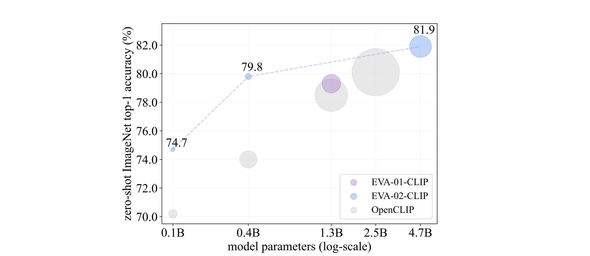

<div align="center">

<h2><a href="http://arxiv.org/abs/2303.15389">EVA-CLIP: Improved Training Techniques for CLIP at Scale</a></h2>

[Quan Sun](https://github.com/Quan-Sun)<sup>1</sup>, [Yuxin Fang](https://github.com/Yuxin-CV)<sup>2,1</sup>, [Ledell Wu](https://scholar.google.com/citations?user=-eJHVt8AAAAJ&hl=en)<sup>1</sup>, [Xinlong Wang](https://www.xloong.wang/)<sup>1</sup>, [Yue Cao](http://yue-cao.me/)<sup>1</sup>
 
<sup>1</sup>[BAAI](https://www.baai.ac.cn/english.html), <sup>2</sup>[HUST](http://english.hust.edu.cn/)

</div>


We launch EVA-CLIP, a series of models that significantly improve the efficiency and effectiveness of CLIP training. 
Our approach incorporates new techniques for representation learning, optimization, and augmentation, enabling EVA-CLIP to achieve superior performance compared to previous CLIP models with the same number of parameters but significantly smaller training costs.

Notably, using exclusively publicly accessible training data, our large-sized EVA-02 CLIP-L/14 can reach up to **80.4** zero-shot top-1 on ImageNet-1K, outperforming the previous largest & best open-modeld CLIP with only ~1/6 parameters and ~1/6 image-text training data. 
Our largest 5.0B-parameter EVA-02 CLIP-E/14 with only 9 billion seen samples achieves **82.0** zero-shot top-1 accuracy on ImageNet-1K.

**Table of Contents**

- [Summary of EVA-CLIP performance](#summary-of-eva-clip-performance)
- [Model Card](#model-card)
  - [EVA-01-CLIP Series](#eva-01-clip-series)
  - [EVA-02-CLIP Series](#eva-02-clip-series)
- [Setup](#setup)
- [Usage](#usage)
- [Evaluation of Zero-shot Image Classification Performance](#evaluation-of-zero-shot-image-classification-performance)
  - [Evaluate EVA-CLIP on IN-1K](#evaluate-eva-clip-on-in-1k)
- [Pre-training](#pre-training)
  - [Pre-train EVA-CLIP on LAION-2B dataset](#pre-train-eva-clip-on-laion-2b-dataset)
- [Extracting image and text features](#extracting-image-and-text-features)
- [BibTeX \& Citation](#bibtex--citation)
- [Acknowledgement](#acknowledgement)


## Summary of EVA-CLIP performance



Summary of CLIP models' ImageNet-1K zero-shot classification performance. 
The diameter of each circle corresponds to forward GFLOPs x the number of training samples.

## Model Card
> `model name` is the checkpoint name of EVA-CLIP. 

> `image enc. init. ckpt` is the checkpoint name that is used to initialize the image encoder of EVA-CLIP. 

> `text enc. init. ckpt` is the checkpoint name that is used to initialize the text encoder of EVA-CLIP.

> `weight` is the link to download the checkpoint of EVA-CLIP.

### EVA-01-CLIP Series

> Image encoder MIM teacher: [OpenAI CLIP-Large](https://github.com/openai/CLIP).

<div align="center">

| model name | image enc. init. ckpt | text enc. init. ckpt | total #params | training precision | training data  |  training batch size |  gpus for training | IN-1K zero-shot top-1 | MSCOCO T2I R@5 | weight |
|:-----|:-----|:-----------|:------:|:------:|:------:|:------:|:------:|:------:|:------:|:------:|
| `EVA01_CLIP_g_14_psz14_s11B` | `EVA01_g_psz14` | `openai/clip-vit-large-patch14` | 1.1B | `fp16` | [LAION-400M](https://laion.ai/blog/laion-400-open-dataset/) | 41K | 256 A100(40GB) | **78.5** | **68.5** | [🤗 HF link](https://huggingface.co/QuanSun/EVA-CLIP/blob/main/EVA01_CLIP_g_14_psz14_s11B.pt) (`2.2GB`) |
| `EVA01_CLIP_g_14_plus_psz14_s11B` | `EVA01_g_psz14` | `laion/CLIP-ViT-H-14-laion2B-s32B-b79K` | 1.3B | `fp16` | Merged-2B | 114K | 112 A100(40GB) | **79.3** | **74.0** | [🤗 HF link](https://huggingface.co/QuanSun/EVA-CLIP/blob/main/EVA01_CLIP_g_14_plus_psz14_s11B.pt) (`2.7GB`) |
</div>

### EVA-02-CLIP Series

> Image encoder MIM teacher: ``EVA01_CLIP_g_14_psz14_s11B``.

<div align="center">

| model name | image enc. init. ckpt | text enc. init. ckpt | total #params | training precision | training data  |  training batch size |  gpus for training | IN-1K zero-shot top-1 | MSCOCO T2I R@5 | weight |
|:-----|:-----|:-----------|:------:|:------:|:------:|:------:|:------:|:------:|:------:|:------:|
| `EVA02_CLIP_B_psz16_s8B` | `EVA02_B_psz14to16` | `openai/clip-vit-base-patch16` | 149M | `fp16` | Merged-2B | 131K | 64 A100(40GB) | **74.7** | **66.9** | [🤗 HF link](https://huggingface.co/QuanSun/EVA-CLIP/blob/main/EVA02_CLIP_B_psz16_s8B.pt) (`300MB`) |
| `EVA02_CLIP_L_psz14_s4B` | `EVA02_L_psz14` | `openai/clip-vit-large-patch14` | 428M | `fp16` | Merged-2B | 131K | 128 A100(40GB) | **79.8** | **71.2** | [🤗 HF link](https://huggingface.co/QuanSun/EVA-CLIP/blob/main/EVA02_CLIP_L_psz14_s4B.pt) (`856MB`) |
| `EVA02_CLIP_L_336_psz14_s6B` | `EVA02_CLIP_L_psz14_224to336` | `EVA02_CLIP_L_psz14_224to336` | 428M | `fp16` | Merged-2B | 61K | 128 A100(40GB) | **80.4** | **71.7** | [🤗 HF link](https://huggingface.co/QuanSun/EVA-CLIP/blob/main/EVA02_CLIP_L_336_psz14_s6B.pt) (`856MB`) |
| `EVA02_CLIP_E_psz14_s4B` | `EVA02_E_psz14` | `laion/CLIP-ViT-H-14-laion2B-s32B-b79K` | 4.7B | `fp16` | [LAION-2B](https://laion.ai/blog/laion-5b/) | 115K | 144 A100(80GB) | **81.9** | **74.7** | [🤗 HF link](https://huggingface.co/QuanSun/EVA-CLIP/blob/main/EVA02_CLIP_E_psz14_s4B.pt) (`9.4GB`) |
| `EVA02_CLIP_E_psz14_plus_s9B` | `EVA02_E_psz14` | `laion/CLIP-ViT-bigG-14-laion2B-39B-b160k` | 5.0B | `bf16` | [LAION-2B](https://laion.ai/blog/laion-5b/) | 144K | 144 A100(80GB) | **82.0** | **75.0** | [🤗 HF link](https://huggingface.co/QuanSun/EVA-CLIP/blob/main/EVA02_CLIP_E_psz14_plus_s9B.pt) (`10.1GB`) |

</div>

- The download links of `image enc. init. ckpt` and `text enc. init. ckpt` are summarized at [here](#pre-train-eva-clip-on-laion-2b-dataset).
- To construct Merged-2B, we merged 1.6 billion samples from [LAION-2B](https://laion.ai/blog/laion-5b/) dataset with 0.4 billion samples from [COYO-700M](https://github.com/kakaobrain/coyo-dataset).
- To our knowledge, EVA-CLIP series are the most performant open-modeld CLIP models at all scales, evaluated via zero-shot classification performance, especially on mainstream classification benchmarks such as ImageNet along with its variants.
For more details about EVA-CLIP, please refer to our [paper](http://arxiv.org/abs/2303.15389).

## Setup


First, clone the repo and install required packages:
```bash
conda create --name rei python=3.8 -y
conda activate rei

git clone git@github.com:baaivision/EVA.git
cd EVA/EVA-CLIP
pip install torch==1.12.1+cu116 torchvision==0.13.1+cu116 --extra-index-url https://download.pytorch.org/whl/cu116
pip install -r requirements.txt
```

Then, install [Apex](https://github.com/NVIDIA/apex#linux) and [xFormer](https://github.com/facebookresearch/xformers#installing-xformers) following the official instruction. 


Core packages: 
- [Pytorch](https://pytorch.org/) version 1.12.1 
- [torchvision](https://pytorch.org/vision/stable/index.html) version 0.13.0
- [timm](https://github.com/rwightman/pytorch-image-models) version 0.5.4 
- [DeepSpeed](https://github.com/microsoft/DeepSpeed) version 0.6.5 (`fp16` training and ZeRO optimizer)
- [Apex](https://github.com/NVIDIA/apex) (fused layer norm)
- [xFormer](https://github.com/facebookresearch/xformers) (fast and memory efficient MHSA)

## Usage

```python
import torch
from eva_clip import create_model_and_transforms, get_tokenizer
from PIL import Image

model_name = "EVA02-CLIP-B-16" 
pretrained = "eva_clip" # or "/path/to/EVA02_CLIP_B_psz16_s8B.pt"

image_path = "CLIP.png"
caption = ["a diagram", "a dog", "a cat"]

device = "cuda" if torch.cuda.is_available() else "cpu"
model, _, preprocess = create_model_and_transforms(model_name, pretrained, force_custom_clip=True)
tokenizer = get_tokenizer(model_name)
model = model.to(device)

image = preprocess(Image.open(image_path)).unsqueeze(0).to(device)
text = tokenizer(["a diagram", "a dog", "a cat"]).to(device)

with torch.no_grad(), torch.cuda.amp.autocast():
    image_features = model.encode_image(image)
    text_features = model.encode_text(text)
    image_features /= image_features.norm(dim=-1, keepdim=True)
    text_features /= text_features.norm(dim=-1, keepdim=True)

    text_probs = (100.0 * image_features @ text_features.T).softmax(dim=-1)

print("Label probs:", text_probs)  # prints: [[0.8275, 0.1372, 0.0352]]
```

## Evaluation of Zero-shot Image Classification Performance
### Evaluate EVA-CLIP on IN-1K
We use the standard IN-1K dataset (1.2M images). 
Download it from http://image-net.org.
Then, move and extract the training and validation images to labeled subfolders, using the [shell script](https://github.com/pytorch/examples/blob/main/imagenet/extract_ILSVRC.sh).

<details>
  <summary>Evaluate the <code>EVA01_CLIP_g_14_psz14_s11B</code> on <b>IN-1K val</b> using a single node with 1 gpu (click to expand).</summary>

```bash    
MODEL_NAME=EVA01-CLIP-g-14

PRETRAINED=/path/to/EVA01_CLIP_g_14_psz14_s11B.pt

# can set PRETRAINED=eva to automaticaly download and load weights; please check details in pretrained.py
# PRETRAINED=eva_clip

DATA_PATH=/path/to/IN-1K/val

cd rei

python -m torch.distributed.launch --nproc_per_node=1 --nnodes=$WORLD_SIZE --node_rank=$RANK \
	--master_addr=$MASTER_ADDR --master_port=12355 --use_env training/main.py \
        --imagenet-val ${DATA_PATH} \
        --model ${MODEL_NAME} \
        --pretrained ${PRETRAINED} \
        --force-custom-clip \
        --enable_deepspeed
```

</details>

<details>
  <summary>Evaluate the <code>EVA01_CLIP_g_14_plus_psz14_s11B</code> on <b>IN-1K val</b> using a single node with 1 gpu (click to expand).</summary>

```bash    
MODEL_NAME=EVA01-CLIP-g-14-plus

PRETRAINED=/path/to/EVA01_CLIP_g_14_plus_psz14_s11B.pt

# can set PRETRAINED=eva to automaticaly download and load weights; please check details in pretrained.py
# PRETRAINED=eva_clip

DATA_PATH=/path/to/IN-1K/val

cd rei

python -m torch.distributed.launch --nproc_per_node=1 --nnodes=$WORLD_SIZE --node_rank=$RANK \
	--master_addr=$MASTER_ADDR --master_port=12355 --use_env training/main.py \
        --imagenet-val ${DATA_PATH} \
        --model ${MODEL_NAME} \
        --pretrained ${PRETRAINED} \
        --force-custom-clip \
        --enable_deepspeed
```

</details>

<details>
  <summary>Evaluate the <code>EVA02_CLIP_B_psz16_s8B</code> on <b>IN-1K val</b> using a single node with 1 gpu (click to expand).</summary>

```bash    
MODEL_NAME=EVA02-CLIP-B-16

PRETRAINED=/path/to/EVA02_CLIP_B_psz16_s8B.pt
# can set PRETRAINED=eva to automaticaly download and load weights; please check details in pretrained.py
# PRETRAINED=eva_clip

DATA_PATH=/path/to/IN-1K/val

cd rei

python -m torch.distributed.launch --nproc_per_node=1 --nnodes=$WORLD_SIZE --node_rank=$RANK \
	--master_addr=$MASTER_ADDR --master_port=12355 --use_env training/main.py \
        --imagenet-val ${DATA_PATH} \
        --model ${MODEL_NAME} \
        --pretrained ${PRETRAINED} \
        --force-custom-clip \
        --enable_deepspeed
```

</details>

<details>
  <summary>Evaluate the <code>EVA02_CLIP_L_psz14_s4B</code> on <b>IN-1K val</b> using a single node with 1 gpu (click to expand).</summary>

```bash    
MODEL_NAME=EVA02-CLIP-L-14

PRETRAINED=/path/to/EVA02_CLIP_L_psz14_s4B.pt
# can set PRETRAINED=eva to automaticaly download and load weights; please check details in pretrained.py
# PRETRAINED=eva_clip

DATA_PATH=/path/to/IN-1K/val

cd rei

python -m torch.distributed.launch --nproc_per_node=1 --nnodes=$WORLD_SIZE --node_rank=$RANK \
	--master_addr=$MASTER_ADDR --master_port=12355 --use_env training/main.py \
        --imagenet-val ${DATA_PATH} \
        --model ${MODEL_NAME} \
        --pretrained ${PRETRAINED} \
        --force-custom-clip \
        --enable_deepspeed
```

</details>


<details>
  <summary>Evaluate the <code>EVA02_CLIP_L_336_psz14_s6B</code> on <b>IN-1K val</b> using a single node with 1 gpu (click to expand).</summary>

```bash    
MODEL_NAME=EVA02-CLIP-L-14-336

PRETRAINED=/path/to/EVA02_CLIP_L_336_psz14_s6B.pt
# can set PRETRAINED=eva to automaticaly download and load weights; please check details in pretrained.py
# PRETRAINED=eva_clip

DATA_PATH=/path/to/IN-1K/val

cd rei

python -m torch.distributed.launch --nproc_per_node=1 --nnodes=$WORLD_SIZE --node_rank=$RANK \
	--master_addr=$MASTER_ADDR --master_port=12355 --use_env training/main.py \
        --imagenet-val ${DATA_PATH} \
        --model ${MODEL_NAME} \
        --pretrained ${PRETRAINED} \
        --force-custom-clip \
        --enable_deepspeed
```

</details>


<details>
  <summary>Evaluate the <code>EVA02_CLIP_E_psz14_s4B</code> on <b>IN-1K val</b> using a single node with 1 gpu (click to expand).</summary>

```bash    
MODEL_NAME=EVA02-CLIP-bigE-14

PRETRAINED=/path/to/EVA02_CLIP_E_psz14_s4B.pt
# can set PRETRAINED=eva to automaticaly download and load weights; please check details in pretrained.py
# PRETRAINED=eva_clip

DATA_PATH=/path/to/IN-1K/val

cd rei

python -m torch.distributed.launch --nproc_per_node=1 --nnodes=$WORLD_SIZE --node_rank=$RANK \
	--master_addr=$MASTER_ADDR --master_port=12355 --use_env training/main.py \
        --imagenet-val ${DATA_PATH} \
        --model ${MODEL_NAME} \
        --pretrained ${PRETRAINED} \
        --force-custom-clip \
        --enable_deepspeed
```

</details>

<details>
  <summary>Evaluate the <code>EVA02_CLIP_E_psz14_plus_s9B</code> on <b>IN-1K val</b> using a single node with 1 gpu (click to expand).</summary>

```bash    
MODEL_NAME=EVA02-CLIP-bigE-14-plus

PRETRAINED=/path/to/EVA02_CLIP_E_psz14_plus_s9B.pt
# can set PRETRAINED=eva to automaticaly download and load weights; please check details in pretrained.py
# PRETRAINED=eva_clip

DATA_PATH=/path/to/IN-1K/val

cd rei

python -m torch.distributed.launch --nproc_per_node=1 --nnodes=$WORLD_SIZE --node_rank=$RANK \
	--master_addr=$MASTER_ADDR --master_port=12355 --use_env training/main.py \
        --imagenet-val ${DATA_PATH} \
        --model ${MODEL_NAME} \
        --pretrained ${PRETRAINED} \
        --force-custom-clip \
        --enable_deepspeed
```

</details>

## Pre-training

### Pre-train EVA-CLIP on LAION-2B dataset

We provide instruction of pre-training EVA-CLIP on LAION-2B dataset and Merged-2B dataset (coming very soon). 

Please prepare [LAION-2B](https://laion.ai/blog/laion-5b/) dataset and [COYO-700M](https://github.com/kakaobrain/coyo-dataset) dataset.
- To construct Merged-2B, merging 1.6 billion random samples from [LAION-2B](https://laion.ai/blog/laion-5b/) dataset with 0.4 billion random samples from [COYO-700M](https://github.com/kakaobrain/coyo-dataset).

Please prepare EVA-01, EVA-02, Openai CLIP and Open CLIP models.

<div align="center">

| model name | total #params | training precision | download link |
|:-----------|:------:|:------:|:------:|
| `EVA01_g_psz14` | 1.0B | `fp16` | [🤗 HF link](https://huggingface.co/QuanSun/EVA-CLIP/blob/main/EVA01_g_psz14.pt) (`2.0GB`) |
| `EVA02_B_psz14to16` | 86M | `fp16` | [🤗 HF link](https://huggingface.co/QuanSun/EVA-CLIP/blob/main/EVA02_B_psz14to16.pt) (`176MB`) |
| `EVA02_L_psz14` | 304M | `fp16` | [🤗 HF link](https://huggingface.co/QuanSun/EVA-CLIP/blob/main/EVA02_L_psz14.pt) (`609MB`) |
| `EVA02_CLIP_L_psz14_224to336` | 428M | `fp16` | [🤗 HF link](https://huggingface.co/QuanSun/EVA-CLIP/blob/main/EVA02_CLIP_L_psz14_224to336.pt) (`857MB`) |
| `EVA02_E_psz14` | 4.4B | `fp16` | [🤗 HF link](https://huggingface.co/QuanSun/EVA-CLIP/blob/main/EVA02_E_psz14.pt) (`8.7GB`) |
| `openai/clip-vit-base-patch16`| 149M | `fp16` | [🤗 HF link](https://huggingface.co/openai/clip-vit-base-patch16/blob/main/pytorch_model.bin) (`599MB`) |
| `openai/clip-vit-large-patch14`| 428M | `fp16` | [🤗 HF link](https://huggingface.co/openai/clip-vit-large-patch14/blob/main/pytorch_model.bin) (`1.7GB`) |
| `laion/CLIP-ViT-H-14-laion2B-s32B-b79K`| 1.0B | `bf16` | [🤗 HF link](https://huggingface.co/laion/CLIP-ViT-H-14-laion2B-s32B-b79K/blob/main/pytorch_model.bin) (`3.9GB`) |
| `laion/CLIP-ViT-bigG-14-laion2B-39B-b160k`| 1.8B | `bf16` | 🤗 HF link [part1](https://huggingface.co/laion/CLIP-ViT-bigG-14-laion2B-39B-b160k/blob/main/pytorch_model-00001-of-00002.bin) [part2](https://huggingface.co/laion/CLIP-ViT-bigG-14-laion2B-39B-b160k/blob/main/pytorch_model-00002-of-00002.bin)(`9.9GB`+`169M`) |

</div>

- EVA02_B_psz14to16 interpolates the kernel size of patch_embed from 14x14 to 16x16, and interpolate the pos_embed from 16x16 to 14x14.

- EVA02_CLIP_L_psz14_224to336 interpolates the pos_embed from 16x16 to 24x24 for training EVA02_CLIP_L_336_psz14_s6B.

- laion/CLIP-ViT-bigG-14-laion2B-39B-b160k consists of 2 parts of weights, [part1](https://huggingface.co/laion/CLIP-ViT-bigG-14-laion2B-39B-b160k/blob/main/pytorch_model-00001-of-00002.bin) and [part2](https://huggingface.co/laion/CLIP-ViT-bigG-14-laion2B-39B-b160k/blob/main/pytorch_model-00002-of-00002.bin).

<details>
<summary>Pre-train <code>EVA01_CLIP_g_14_plus_psz14_s11B</code> on <b>Merged-2B</b> with 14 nodes (click to expand).</summary>

```bash
MODEL=EVA01-CLIP-g-14-plus
PRETRAINED_IMAGE=/path/to/EVA01_g_psz14.pt
PRETRAINED_TEXT=/path/to/laion/CLIP-ViT-H-14-laion2B-s32B-b79K/pytorch_model.bin

PRETRAINED_VISUAL_MODEL=EVA01-g-14-plus
PRETRAINED_TEXT_MODEL=OpenCLIP-H-14

# can automaticaly download and load pretrained models by follwing 4 lines; please check details in pretrained.py
# PRETRAINED_IMAGE=eva
# PRETRAINED_TEXT=laion2b_s32b_b79k
# PRETRAINED_VISUAL_MODEL=EVA01-g-14-plus
# PRETRAINED_TEXT_MODEL=OpenCLIP-H-14

# Following OpenCLIP, we preprocess data by webdataset. We concat paths of LAION-2B and COYO-700M with `;`.
MERGE_2B_DATA_PATH="/path/to/laion2b_en_data/img_data/{000000..164090}.tar;/path/to/coyo700m_en_data/img_data/{000000..047435}.tar"
# LAION_2B_DATA_PATH="/path/to/laion2b_en_data/img_data/{000000..164090}.tar"
VAL_DATA_PATH=/path/to/IN-1K/val

cd rei

python -m torch.distributed.launch --nproc_per_node=8 \
       	--nnodes=$WORLD_SIZE --node_rank=$RANK \
	--master_addr=$MASTER_ADDR --master_port=12355 --use_env \
    training/main.py \
        --save-frequency 1 \
        --zeroshot-frequency 1 \
        --report-to="wandb, tensorboard" \
        --wandb-project-name="eva-clip" \
        --wandb-notes="eva01_clip_g_plus_14" \
        --train-num-samples 40000000 \
        --dataset-resampled \
        --train-data-list=${MERGE_2B_DATA_PATH} \
        --dataset-type-list="webdataset;webdataset" \
        --imagenet-val=${VAL_DATA_PATH} \
        --warmup 2000 \
        --batch-size=1024 \
        --epochs=100 \
        --lr=5e-4 \
        --visual-lr=4e-4 \
        --text-lr=4e-5 \
        --wd=0.05 \
        --visual-wd=0.05 \
        --text-wd=0.05 \
        --ld=1.0 \
        --visual-ld=0.85 \
        --text-ld=0.75 \
        --grad-clip-norm=5.0 \
        --smoothing=0. \
        --workers=8 \
        --model=${MODEL} \
        --pretrained-image=${PRETRAINED_IMAGE} \
        --pretrained-text=${PRETRAINED_TEXT} \
        --pretrained-visual-model=${PRETRAINED_VISUAL_MODEL} \
        --pretrained-text-model=${PRETRAINED_TEXT_MODEL} \
        --skip-list head.weight head.bias lm_head.weight lm_head.bias mask_token text_projection logit_scale \
        --seed 4096 \
        --gather-with-grad \
        --grad-checkpointing \
        --local-loss \
        --force-custom-clip \
        --force-patch-dropout=0.5 \
        --optimizer="lamb" \
        --zero-stage=1 \
        --enable-deepspeed
```

</details>

<details>
<summary>Pre-train <code>EVA02_CLIP_B_psz16_s8B</code> on <b>Merged-2B</b> with 8 nodes (click to expand).</summary>

```bash
MODEL=EVA02-CLIP-B-16
PRETRAINED_IMAGE=/path/to/EVA02_B_psz14to16.pt
PRETRAINED_TEXT=/path/to/openai/clip-vit-base-patch16/pytorch_model.bin
PRETRAINED_VISUAL_MODEL=EVA02-B-16
PRETRAINED_TEXT_MODEL=OpenaiCLIP-B-16

# can automaticaly download and load pretrained models by follwing 4 lines; please check details in pretrained.py
# PRETRAINED_IMAGE=eva
# PRETRAINED_TEXT=openai
# PRETRAINED_VISUAL_MODEL=EVA02-B-16
# PRETRAINED_TEXT_MODEL=OpenaiCLIP-B-16

# Following OpenCLIP, we preprocess data by webdataset. We concat paths of LAION-2B and COYO-700M with `;`.

MERGE_2B_DATA_PATH="/path/to/laion2b_en_data/img_data/{000000..164090}.tar;/path/to/coyo700m_en_data/img_data/{000000..047435}.tar"
# LAION_2B_DATA_PATH="/path/to/laion2b_en_data/img_data/{000000..164090}.tar"
VAL_DATA_PATH=/path/to/IN-1K/val

cd rei

python -m torch.distributed.launch --nproc_per_node=8 \
       	--nnodes=$WORLD_SIZE --node_rank=$RANK \
	--master_addr=$MASTER_ADDR --master_port=12355 --use_env \
    training/main.py \
        --save-frequency 1 \
        --zeroshot-frequency 1 \
        --report-to="wandb, tensorboard" \
        --wandb-project-name="eva-clip" \
        --wandb-notes="eva02_clip_B_16" \
        --train-num-samples 40000000 \
        --dataset-resampled \
        --train-data-list=${MERGE_2B_DATA_PATH} \
        --dataset-type-list="webdataset;webdataset" \
        --imagenet-val=${VAL_DATA_PATH} \
        --warmup 2000 \
        --batch-size=2048 \
        --epochs=200 \
        --lr=5e-4 \
        --visual-lr=2e-4 \
        --text-lr=2e-5 \
        --wd=0.05 \
        --visual-wd=0.05 \
        --text-wd=0.05 \
        --ld=1.0 \
        --visual-ld=0.75 \
        --text-ld=0.75 \
        --grad-clip-norm=5.0 \
        --smoothing=0. \
        --workers=8 \
        --model=${MODEL} \
        --pretrained-image=${PRETRAINED_IMAGE} \
        --pretrained-text=${PRETRAINED_TEXT} \
        --pretrained-visual-model=${PRETRAINED_VISUAL_MODEL} \
        --pretrained-text-model=${PRETRAINED_TEXT_MODEL} \
        --skip-list head.weight head.bias lm_head.weight lm_head.bias mask_token text_projection logit_scale \
        --seed 4096 \
        --gather-with-grad \
        --grad-checkpointing \
        --local-loss \
        --force-custom-clip \
        --force-patch-dropout=0 \
        --optimizer="lamb" \
        --zero-stage=1 \
        --enable-deepspeed
```

</details>

<details>
<summary>Pre-train <code>EVA02_CLIP_L_psz14_s4B</code> on <b>Merged-2B</b> with 16 nodes (click to expand).</summary>

```bash
MODEL=EVA02-CLIP-L-14
PRETRAINED_IMAGE=/path/to/EVA02_L_psz14.pt
PRETRAINED_TEXT=/path/to/openai/clip-vit-large-patch14/pytorch_model.bin
PRETRAINED_VISUAL_MODEL=EVA02-L-14
PRETRAINED_TEXT_MODEL=OpenaiCLIP-L-14

# can automaticaly download and load pretrained models by follwing 4 lines; please check details in pretrained.py
# PRETRAINED_IMAGE=eva
# PRETRAINED_TEXT=openai
# PRETRAINED_VISUAL_MODEL=EVA02-L-14
# PRETRAINED_TEXT_MODEL=OpenaiCLIP-L-14

# Following OpenCLIP, we preprocess data by webdataset. We concat paths of LAION-2B and COYO-700M with `;`.
MERGE_2B_DATA_PATH="/path/to/laion2b_en_data/img_data/{000000..164090}.tar;/path/to/coyo700m_en_data/img_data/{000000..047435}.tar"
# LAION_2B_DATA_PATH="/path/to/laion2b_en_data/img_data/{000000..164090}.tar"
VAL_DATA_PATH=/path/to/IN-1K/val

cd rei

python -m torch.distributed.launch --nproc_per_node=8 \
       	--nnodes=$WORLD_SIZE --node_rank=$RANK \
	--master_addr=$MASTER_ADDR --master_port=12355 --use_env \
    training/main.py \
        --save-frequency 1 \
        --zeroshot-frequency 1 \
        --report-to="wandb, tensorboard" \
        --wandb-project-name="eva-clip" \
        --wandb-notes="eva02_clip_L_14" \
        --train-num-samples 40000000 \
        --dataset-resampled \
        --train-data-list=${MERGE_2B_DATA_PATH} \
        --dataset-type-list="webdataset;webdataset" \
        --imagenet-val=${VAL_DATA_PATH} \
        --warmup 2000 \
        --batch-size=1024 \
        --epochs=100 \
        --lr=5e-4 \
        --visual-lr=4e-4 \
        --text-lr=4e-5 \
        --wd=0.05 \
        --visual-wd=0.05 \
        --text-wd=0.05 \
        --ld=1.0 \
        --visual-ld=0.85 \
        --text-ld=0.75 \
        --grad-clip-norm=5.0 \
        --smoothing=0. \
        --workers=8 \
        --model=${MODEL} \
        --pretrained-image=${PRETRAINED_IMAGE} \
        --pretrained-text=${PRETRAINED_TEXT} \
        --pretrained-visual-model=${PRETRAINED_VISUAL_MODEL} \
        --pretrained-text-model=${PRETRAINED_TEXT_MODEL} \
        --skip-list head.weight head.bias lm_head.weight lm_head.bias mask_token text_projection logit_scale \
        --seed 4096 \
        --gather-with-grad \
        --grad-checkpointing \
        --local-loss \
        --force-custom-clip \
        --force-patch-dropout=0 \
        --optimizer="lamb" \
        --zero-stage=1 \
        --enable-deepspeed
```

</details>

<details>
<summary>Pre-train <code>EVA02_CLIP_L_psz14_224to336</code> on <b>Merged-2B</b> with 16 nodes (click to expand).</summary>

```bash
MODEL=EVA02-CLIP-L-14-336
PRETRAINED=/path/to/EVA02_CLIP_L_psz14_224to336.pt

# can automaticaly download and load pretrained models by follwing 2 lines; please check details in pretrained.py
# MODEL=EVA02-CLIP-L-14-336
# PRETRAINED=eva_clip_224to336

# Following OpenCLIP, we preprocess data by webdataset. We concat paths of LAION-2B and COYO-700M with `;`.
MERGE_2B_DATA_PATH="/path/to/laion2b_en_data/img_data/{000000..164090}.tar;/path/to/coyo700m_en_data/img_data/{000000..047435}.tar"
# LAION_2B_DATA_PATH="/path/to/laion2b_en_data/img_data/{000000..164090}.tar"
VAL_DATA_PATH=/path/to/IN-1K/val

cd rei

python -m torch.distributed.launch --nproc_per_node=8 \
       	--nnodes=$WORLD_SIZE --node_rank=$RANK \
	--master_addr=$MASTER_ADDR --master_port=12355 --use_env \
    training/main.py \
        --save-frequency 1 \
        --zeroshot-frequency 1 \
        --report-to="wandb, tensorboard" \
        --wandb-project-name="eva-clip" \
        --wandb-notes="eva02_clip_L_14_336" \
        --train-num-samples 40000000 \
        --dataset-resampled \
        --train-data-list=${MERGE_2B_DATA_PATH} \
        --dataset-type-list="webdataset;webdataset" \
        --imagenet-val=${VAL_DATA_PATH} \
        --warmup 2000 \
        --batch-size=480 \
        --epochs=50 \
        --lr=5e-4 \
        --visual-lr=4e-4 \
        --text-lr=4e-5 \
        --wd=0.05 \
        --visual-wd=0.05 \
        --text-wd=0.05 \
        --ld=1.0 \
        --visual-ld=0.75 \
        --text-ld=0.65 \
        --grad-clip-norm=5.0 \
        --smoothing=0. \
        --workers=8 \
        --model=${MODEL} \
        --pretrained=${PRETRAINED} \
        --skip-list head.weight head.bias lm_head.weight lm_head.bias mask_token text_projection logit_scale \
        --seed 4096 \
        --gather-with-grad \
        --grad-checkpointing \
        --local-loss \
        --force-custom-clip \
        --force-patch-dropout=0 \
        --optimizer="lamb" \
        --zero-stage=1 \
        --enable-deepspeed
```

</details>

<details>
<summary>Pre-train <code>EVA02_CLIP_E_psz14_s4B</code> on <b>LAION-2B</b> with 18 nodes (click to expand).</summary>

```bash
MODEL=EVA02-CLIP-bigE-14
PRETRAINED_IMAGE=/path/to/EVA02_E_psz14.pt
PRETRAINED_TEXT=/path/to/laion/CLIP-ViT-H-14-laion2B-s32B-b79K/pytorch_model.bin
PRETRAINED_VISUAL_MODEL=EVA02-bigE-14
PRETRAINED_TEXT_MODEL=OpenCLIP-H-14

# can automaticaly download and load pretrained models by follwing 4 lines; please check details in pretrained.py
# PRETRAINED_IMAGE=eva
# PRETRAINED_TEXT=laion2b_s32b_b79k
# PRETRAINED_VISUAL_MODEL=EVA02-bigE-14
# PRETRAINED_TEXT_MODEL=OpenCLIP-H-14

# Following OpenCLIP, we preprocess data by webdataset. We concat paths of LAION-2B and COYO-700M with `;`.
# MERGE_2B_DATA_PATH="/path/to/laion2b_en_data/img_data/{000000..164090}.tar;/path/to/coyo700m_en_data/img_data/{000000..047435}.tar"
LAION_2B_DATA_PATH="/path/to/laion2b_en_data/img_data/{000000..164090}.tar"
VAL_DATA_PATH=/path/to/IN-1K/val

cd rei

python -m torch.distributed.launch --nproc_per_node=8 \
       	--nnodes=$WORLD_SIZE --node_rank=$RANK \
	--master_addr=$MASTER_ADDR --master_port=12355 --use_env \
    training/main.py \
        --save-frequency 1 \
        --zeroshot-frequency 1 \
        --report-to="wandb, tensorboard" \
        --wandb-project-name="eva-clip" \
        --wandb-notes="eva02_clip_E_14" \
        --train-num-samples 40000000 \
        --dataset-resampled \
        --train-data=${LAION_2B_DATA_PATH} \
        --dataset-type="webdataset" \
        --imagenet-val=${VAL_DATA_PATH} \
        --warmup 2000 \
        --batch-size=800 \
        --epochs=100 \
        --lr=5e-4 \
        --visual-lr=4e-4 \
        --text-lr=4e-5 \
        --wd=0.05 \
        --visual-wd=0.05 \
        --text-wd=0.05 \
        --ld=1.0 \
        --visual-ld=0.9 \
        --text-ld=0.75 \
        --grad-clip-norm=5.0 \
        --smoothing=0. \
        --workers=8 \
        --model=${MODEL} \
        --pretrained-image=${PRETRAINED_IMAGE} \
        --pretrained-text=${PRETRAINED_TEXT} \
        --pretrained-visual-model=${PRETRAINED_VISUAL_MODEL} \
        --pretrained-text-model=${PRETRAINED_TEXT_MODEL} \
        --skip-list head.weight head.bias lm_head.weight lm_head.bias mask_token text_projection logit_scale \
        --seed 4096 \
        --gather-with-grad \
        --grad-checkpointing \
        --local-loss \
        --force-custom-clip \
        --force-patch-dropout=0.5 \
        --optimizer="lamb" \
        --zero-stage=1 \
        --enable-deepspeed
```

</details>

<details>
<summary>Pre-train <code>EVA02_CLIP_E_psz14_plus_s9B</code> on <b>LAION-2B</b> with 18 nodes (click to expand).</summary>

```bash
MODEL=EVA02-CLIP-bigE-14-plus
PRETRAINED_IMAGE=/path/to/EVA02_CLIP_E_psz14_plus_s9B.pt
PRETRAINED_TEXT=/path/to/laion/CLIP-ViT-bigG-14-laion2B-39B-b160k/pytorch_model.bin # ckpt is splited into 2 parts. could merge first then load.
PRETRAINED_VISUAL_MODEL=EVA02-bigE-14
PRETRAINED_TEXT_MODEL=OpenCLIP-bigG-14

# can automaticaly download and load pretrained models by follwing 4 lines; please check details in pretrained.py
# PRETRAINED_IMAGE=eva
# PRETRAINED_TEXT=laion2b_s39b_b160k
# PRETRAINED_VISUAL_MODEL=EVA02-bigE-14
# PRETRAINED_TEXT_MODEL=OpenCLIP-bigG-14


# Following OpenCLIP, we preprocess data by webdataset. We concat paths of LAION-2B and COYO-700M with `;`.
# MERGE_2B_DATA_PATH="/path/to/laion2b_en_data/img_data/{000000..164090}.tar;/path/to/coyo700m_en_data/img_data/{000000..047435}.tar"
LAION_2B_DATA_PATH="/path/to/laion2b_en_data/img_data/{000000..164090}.tar"
VAL_DATA_PATH=/path/to/IN-1K/val

cd rei

python -m torch.distributed.launch --nproc_per_node=8 \
       	--nnodes=$WORLD_SIZE --node_rank=$RANK \
	--master_addr=$MASTER_ADDR --master_port=12355 --use_env \
    training/main.py \
        --save-frequency 1 \
        --zeroshot-frequency 1 \
        --report-to="wandb, tensorboard" \
        --wandb-project-name="eva-clip" \
        --wandb-notes="eva02_clip_E_14" \
        --train-num-samples 40000000 \
        --dataset-resampled \
        --train-data=${LAION_2B_DATA_PATH} \
        --dataset-type="webdataset" \
        --imagenet-val=${VAL_DATA_PATH} \
        --warmup 2000 \
        --batch-size=1000 \
        --epochs=100 \
        --lr=5e-4 \
        --visual-lr=4e-4 \
        --text-lr=4e-5 \
        --wd=0.05 \
        --visual-wd=0.05 \
        --text-wd=0.05 \
        --ld=1.0 \
        --visual-ld=0.9 \
        --text-ld=0.75 \
        --grad-clip-norm=5.0 \
        --smoothing=0. \
        --workers=8 \
        --model=${MODEL} \
        --name='eva-vit-4b-14-text-bigG-x-lamb-patch_drop-18nodes-b144k-laion2b' \
        --pretrained-image=${PRETRAINED_IMAGE} \
        --pretrained-text=${PRETRAINED_TEXT} \
        --pretrained-visual-model=${PRETRAINED_VISUAL_MODEL} \
        --pretrained-text-model=${PRETRAINED_TEXT_MODEL} \
        --skip-list head.weight head.bias lm_head.weight lm_head.bias mask_token text_projection logit_scale \
        --seed 4096 \
        --gather-with-grad \
        --grad-checkpointing \
        --local-loss \
        --force-custom-clip \
        --force-patch-dropout=0.5 \
        --optimizer="lamb" \
        --zero-stage=1 \
        --enable-deepspeed
```
</details>

## Extracting image and text features

Easily extracting image and text features in distribution and saving in .npy format. Here is an example of how you can do it:

```shell
MODEL=EVA02-CLIP-B-16
PRETRAINED=eva_clip
LAION_2B_DATA_PATH="/path/to/laion2b_en_data/img_data/{000000..164090}.tar"

IMG_EMB_PATH="/path/to/store/output/image_embedding"
TEXT_EMB_PATH="/path/to/store/output/text_embedding"

cd rei

python -m torch.distributed.launch --nproc_per_node=8 --nnodes=$WORLD_SIZE --node_rank=$RANK \
	--master_addr=$MASTER_ADDR --master_port=12355 --use_env training/main.py \
        --val-data=${LAION_2B_DATA_PATH} \
        --val-num-samples 2000000000 \
        --batch-size 1024 \
        --model ${MODEL} \
        --force-custom-clip \
        --pretrained ${PRETRAINED} \
        --extract-features \
        --img-emb-path ${IMG_EMB_PATH} \
        --text-emb-path ${TEXT_EMB_PATH} \
        --save-interval 10 \
        --enable_deepspeed
```

## BibTeX & Citation

```
@article{EVA-CLIP,
  title={EVA-CLIP: Improved Training Techniques for CLIP at Scale},
  author={Sun, Quan and Fang, Yuxin and Wu, Ledell and Wang, Xinlong and Cao, Yue},
  journal={arXiv preprint arXiv:2303.15389},
  year={2023}
}
```


## Acknowledgement
EVA-CLIP is built using the awesome [OpenCLIP](https://github.com/mlfoundations/open_clip), [EVA-01](https://github.com/baaivision/EVA/tree/master/EVA-01), [CLIP](https://github.com/openai/CLIP), [timm](https://github.com/rwightman/pytorch-image-models), [DeepSpeed](https://github.com/microsoft/DeepSpeed), [Apex](https://github.com/NVIDIA/apex) and [xFormer](https://github.com/facebookresearch/xformers).

