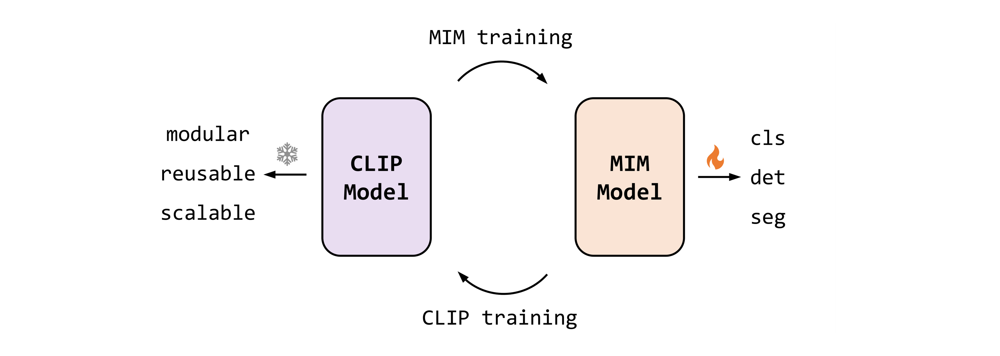

<h2>EVA: Visual Representation Fantasies from BAAI</h2>

- [**EVA-01**](EVA-01) (CVPR 2023, 🌟highlight🌟) - Exploring the Limits of Masked Visual Representation Learning at Scale

- [**EVA-02**](EVA-02) (Arxiv 2023) - A Visual Representation for Neon Genesis

- [**EVA-CLIP**](EVA-CLIP) (Arxiv 2023) - Improved Training Techniques for CLIP at Scale

- [**EVA-CLIP-18B**](EVA-CLIP-18B) (Arxiv 2024) - EVA-CLIP-18B: Scaling CLIP to 18 Billion Parameters
  
- [**EVA @ Hugging Face 🤗 & `timm`**](https://huggingface.co/timm/eva02_large_patch14_448.mim_m38m_ft_in1k)

- [**EVA-CLIP @ Hugging Face 🤗 & `timm`**](https://huggingface.co/timm/eva02_enormous_patch14_plus_clip_224.laion2b_s9b_b144k)

- [**EVA-CLIP @ `open_clip`**](https://github.com/mlfoundations/open_clip/blob/main/src/open_clip/model_configs/EVA02-E-14-plus.json) 

## Contact
- **We are hiring** at all levels at BAAI Vision Team, including full-time researchers, engineers and interns. 
If you are interested in working with us on **foundation model, self-supervised learning and multimodal learning**, please contact [Xinlong Wang](https://www.xloong.wang/) (`wangxinlong@baai.ac.cn`).

## License

The content of this project itself is licensed under [LICENSE](LICENSE).

## Misc

